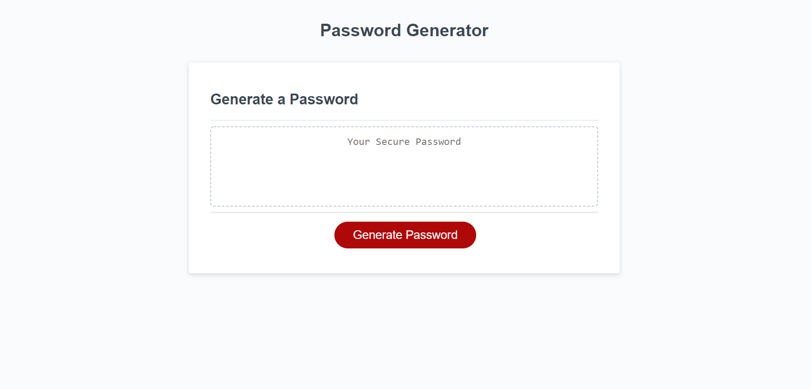
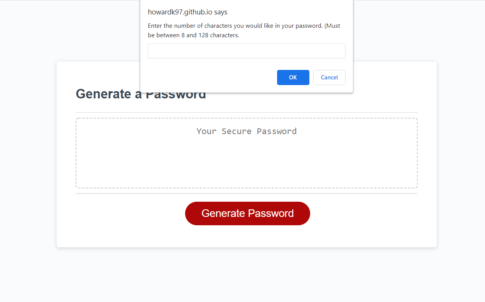
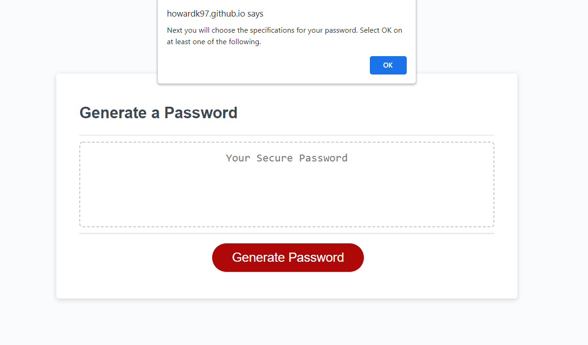
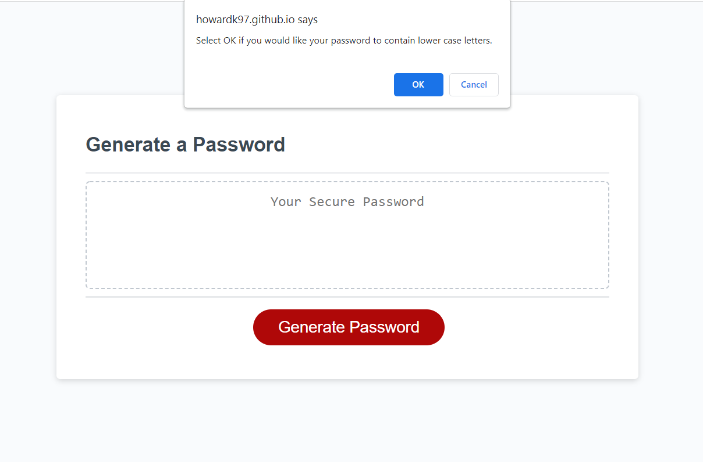
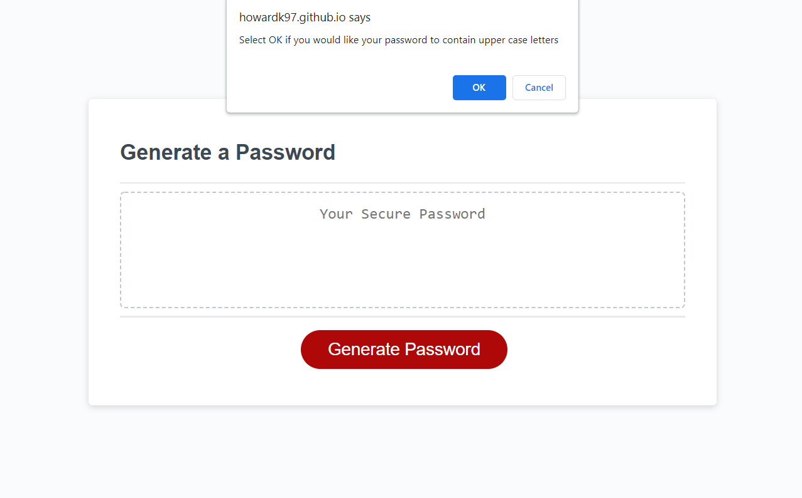
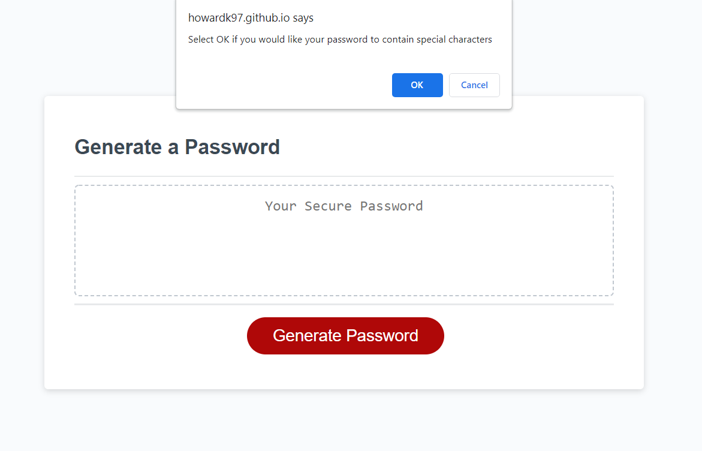
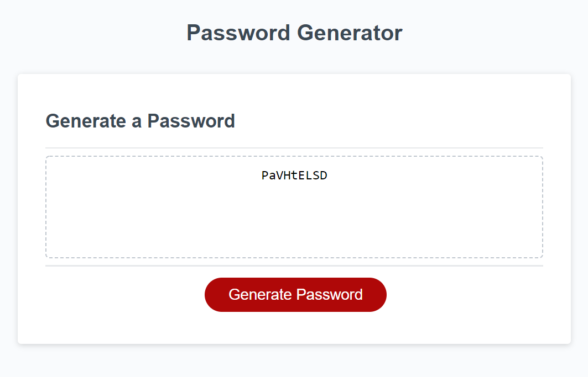

# challenge-3

# Description
This is a password generator app. Once the "Generate Password" button is clicked on, a window appears that prompts the user to enter the length of their desired password. Then, more windows appear that ask the user what type of characters they want to include in their password. Once the user makes their selections, a password is generated for them on the screen.

# Images
How the webpage should look at each step of the process:

1) The original page of the webpage.

2) Prompt for user to enter password length

3) Describes next steps of process to user.

4) Asks user if they would like lower case letters in their password.

5) Asks user if they would like upper case letters in their password.

6) Asks user if they would like special characters in their password.

7) Asks user if they would like numbers in their password.

8) Password is generated and displayed on the screen.

# Webpage
Below is a link to the webpage.

[Password Generator](https://howardk97.github.io/challenge-3/)