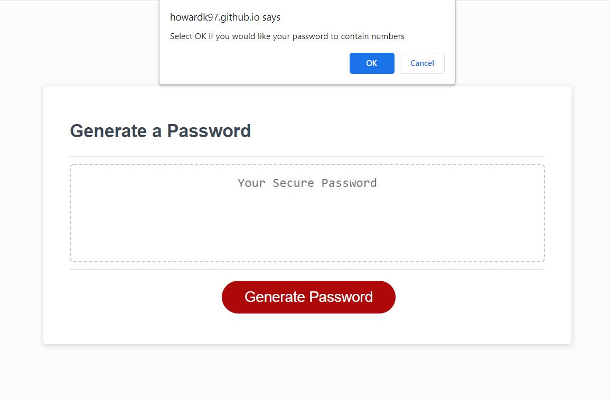

# challenge-3

# Description
This is a password generator app. Once the "Generate Password" button is clicked on, a window appears that prompts the user to enter the length of their desired password. Then, more windows appear that ask the user what type of characters they want to include in their password. Once the user makes their selections, a password is generated for them on the screen.

# Images
How the webpage should look at each step of the process:

# Webpage
Below is a link to the webpage.

[Webpage](https://howardk97.github.io/challenge-3/)